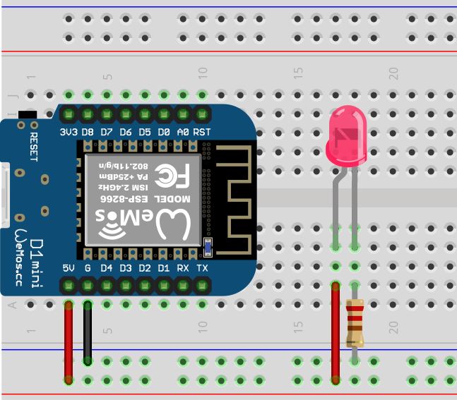

# Getting Started with Micro Controllers and ESPHome

The following sections contain a quick start guide to using different
electronic modules together with the [Wemos D1Mini](https://www.wemos.cc/en/latest/d1/d1_mini.html)
micro controller. Staring from powering an LED in the first
section more complexity is added in each section. However, these documents
are by no means a complete guide. Instead, the goal is to help novices getting started.

**Note**: It should be possible to follow the tutorial with any micro controller
supported by [ESPHome](https://esphome.io). In this case the circuits and
ESPHome configurations need to be adapted to the micro controller.

## Step 0: Powering an LED

In order to get stated the initial step is to implement the Hello World of
electronics, i.e. switching on a light. In this example a LED is powered using
the micro controller. To power the LED use the D1Mini module, the breadboard,
a LED and a 220Ω resistor to build the circuit shown in the following image.

To select the right resistor the
[Resistor Color Code Calculator](https://resistorcolorcodecalc.com/) can be used.

Once the micro controller is connected to the USB cable, the LED should light up.
If the LED does not light up try to turn it around. Note, that an LED is a
[diode](https://en.wikipedia.org/wiki/Diode). This means, in only conducts
current in one direction.

## Step 1: Install ESPHome on the D1Mini

## Step 2: Control an LED

## Step 3: Control the LED with a button

## Step 4: Measure temperature and humidity

## Navigation

- [Previous Section ⬅️](./10-overview.md)
- [Next Section ➡️](./30-iot.md)
