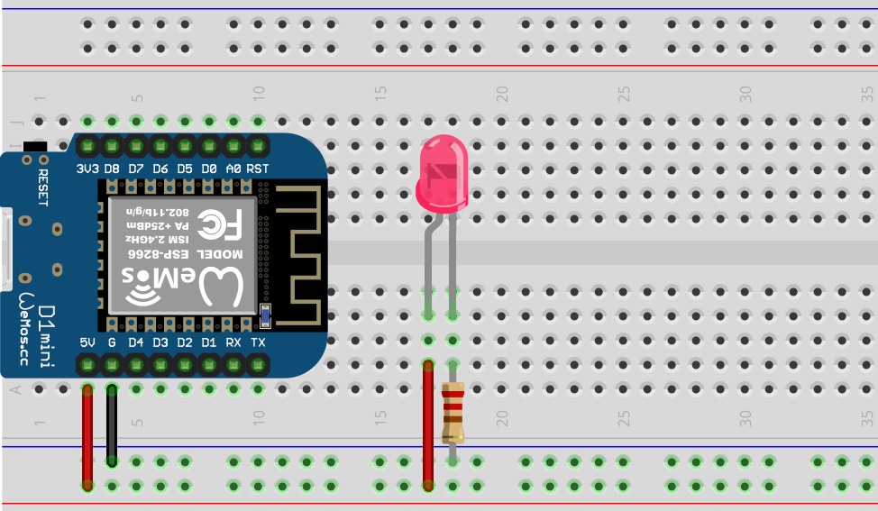
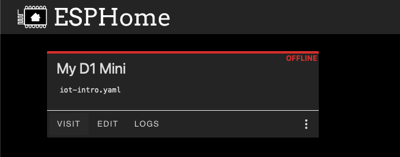

# Getting Started with Micro Controllers and ESPHome

The following sections contain a quick start guide to using different
electronic modules together with the [Wemos D1Mini](https://www.wemos.cc/en/latest/d1/d1_mini.html)
micro controller. Staring from powering an LED in the first
section more complexity is added in each section. However, these documents
are by no means a complete guide. Instead, the goal is to help novices getting started.

There is also a YouTube video showing the steps described in this chapter.
[](https://www.youtube.com/embed/C-klK8bkEC8)

**Note**: It should be possible to follow the tutorial with any micro controller
supported by [ESPHome](https://esphome.io). In this case the circuits and
ESPHome configurations need to be adapted to the micro controller.

## Step 0: Powering an LED

In order to get stated the initial step is to implement the Hello World of
electronics, i.e. switching on a light. In this example a LED is powered using
the micro controller. To power the LED use the D1Mini module, the breadboard,
a LED and a 220Ω resistor to build the circuit shown in the following image.

To select the right resistor the
[Resistor Color Code Calculator](https://resistorcolorcodecalc.com/) can be used.



Once the micro controller is connected to the USB cable, the LED should light up.
If the LED does not light up try to turn it around. Note, that an LED is a
[diode](https://en.wikipedia.org/wiki/Diode). This means, in only conducts
current in one direction.

## Step 1: Install ESPHome on the D1Mini

The next step is to install ESPHome on the D1Mini. In order to do so you
first need to install ESPHome locally. The installation instructions
for ESPHome can be found [here](https://esphome.io/guides/installing_esphome).

Once ESPHome is installed, the ESPHome dashboard can be started using the
following command.
In this command the `.` is the directory in which the ESPHome configurations are
stored. I would recommend creating a dedicated directory for your project.

```zsh
esphome dashboard .
```

The ESPHome dashboard can be accessed at [http://localhost:6052](http://localhost:6052).
To install the ESPHome firmware on the D1Mini click on the `+ New Device` button.
In the create configuration screen name the new device.
In the screen shot below the device is named `iot-tutorial`.


When adding the first device to ESPHome also the name and password of
the WiFi network are needed. Enter the name and password of your WiFi network.
Click on `Next` to select the device type. In case of the D1Mini the
correct device type is `ESP8266`. Selecting the device type completes
the initial configuration.

**Note**: The WiFi network and password are stored in a `secrets.yaml` file
in the ESPHome directory.

Finishing the configuration results in a new tile on the ESPHome dashboard.
In the screenshot below the tile is named My D1 Mini. The name depends on the
name selected when creating the new configuration.



By clicking on _Edit_ the configuration YAML of the device can be
viewed and edited. After the initial configuration the YAML should
look similar to the following listing. For this tutorial it is  
important to remove the section enabling the HomeAssistant API
in ESPHome as it will lead to a constant restarting of the device.

```YAML
esphome:
  name: iot-getting-started
  friendly_name: IoT Getting Started

esp8266:
  board: d1_mini

# Enable logging
logger:

ota:
  password: "204fd9489934ff4d24909949bdb3bdb6"

wifi:
  networks:
    - ssid: !secret wifi_ssid
      password: !secret wifi_password
    - ssid: !secret wifi_ssid_2
      password: !secret wifi_password_2

  # Enable fallback hotspot (captive portal) in case wifi connection fails
  ap:
    ssid: "Iot-Getting-Started"
    password: "C0VoOIqD2eWk"

captive_portal:

web_server:
```

## Step 2: Control an LED

```yaml
# LED output
light:
  - platform: monochromatic
    id: red_led
    name: "Red LED"
    output: gpio_d2
    effects:
      - pulse:

output:
  - platform: esp8266_pwm
    id: gpio_d2
    pin: D2
```

The complete YAML file including the LED output is available [here](../src/iot-getting-started-02.yaml)

## Step 3: Control the LED with a button

```yaml
# Button input
binary_sensor:
  - platform: gpio
    pin:
      number: D5
      inverted: true
      mode:
        input: true
        pullup: true
    name: "Little Button"
    on_press:
      then:
        - light.toggle: red_led
```

The complete YAML file including the button to control the LED is available [here](../src/iot-getting-started-03.yaml)

## Navigation

- [Previous Section ⬅️](./10-overview.md)
- [Next Section ➡️](./30-iot.md)
